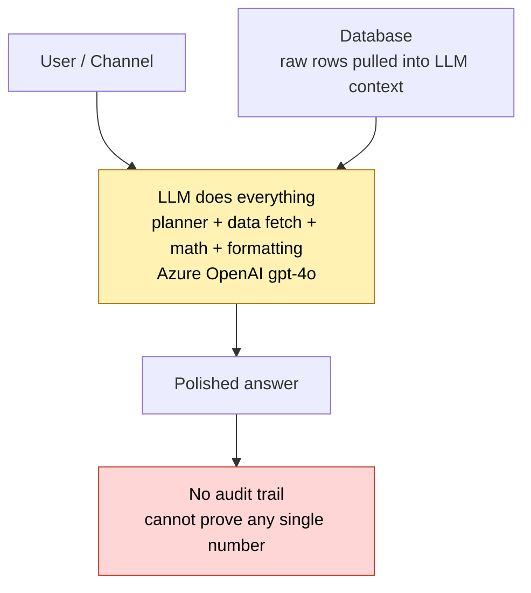
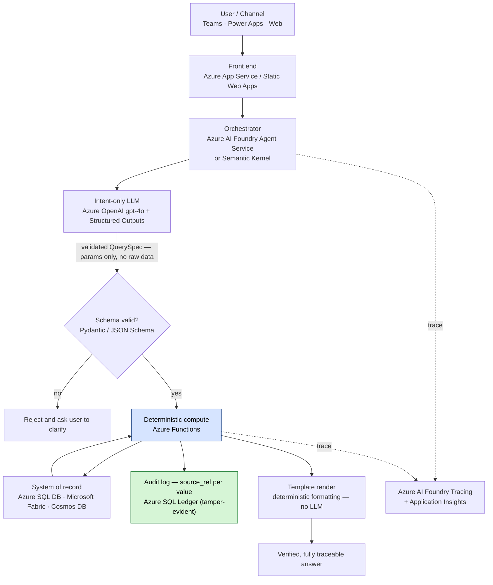

# Desafío 03 — Orquestador verificable

## 🏛️ Escenario empresarial

> **Empresa:** Vantage Analytics — una firma de servicios de datos financieros que vende reportes de inteligencia de mercado generados por IA a inversionistas institucionales  
> **Situación:** FINRA ha abierto una revisión de tu sistema de reportes con IA. La pregunta es: "For each figure in your Q1 2026 AI-generated report, can you demonstrate it came directly from a data source, was computed deterministically, and was not altered by the AI model?"  
> **Arquitectura actual:** Simple Agentic — el LLM obtiene datos, hace cálculos dentro del contexto y formatea la salida.  
> **Respuesta actual a FINRA:** no. No puedes rastrear ninguna cifra hasta su fuente.

Tienes 30 días para rediseñar la arquitectura antes de la auditoría formal.

---

## La idea en 30 segundos

**Lo que vas a construir:** un agente de reportes donde el LLM *nunca toca un número*. Solo convierte la solicitud del usuario en parámetros estructurados; luego, código determinista hace la obtención de datos, el cálculo y el formateo, y cada cifra lleva un `source_ref` que puedes entregar a un auditor.

> **El principio clave:** el LLM decide *qué* calcular. Nunca lo calcula.

**❌ Simple Agentic — la trampa** &nbsp; *(el modelo obtiene **y** calcula, así que un número incorrecto se ve exactamente igual que uno correcto)*



**✅ Verifiable Orchestrator — la corrección** &nbsp; *(el LLM solo emite parámetros; el código determinista produce cada número)*



<details>
<summary>🏗️ <strong>Llévalo a un cliente</strong> — componentes reales de Azure, tabla de decisión y discurso de venta</summary>

**Simple Agentic vs Verifiable Orchestrator**

| Componente | Simple Agentic | Verifiable Orchestrator |
|-----------|---------------|------------------------|
| Intent parsing | LLM | LLM |
| Data fetching | El LLM decide parámetros de herramientas de forma probabilística | El LLM emite parámetros estructurados → obtención determinista |
| Calculation | Aritmética del LLM (predicción de tokens) | Matemática en Python (determinista) |
| Formatting | Lenguaje natural del LLM | Renderizado basado en templates |
| Audit trail | Ninguno | Cada valor tiene `source_ref` |
| Accuracy guarantee | Ninguna | 100% para valores obtenidos, solo &lt;0.001% de redondeo |
| Regulatory defensibility | Ninguna | Completa — audit log consultable |

**Qué desplegar realmente**

| Etapa del pipeline | Su única función | Servicio Azure / Microsoft (principal) | Alternativa confiable de terceros |
|----------------|-------------|--------------------------------------|--------------------------|
| **Channel / UI** | Dónde pregunta el usuario | Microsoft Teams (Copilot), **Power Apps**, **Azure Static Web Apps** / **App Service** | React SPA, Slack *(third-party)* |
| **Orchestration** | Coordinar el flujo + enrutar herramientas | **Azure AI Foundry Agent Service** · **Semantic Kernel** ([docs](https://learn.microsoft.com/semantic-kernel/overview/)) | LangGraph, LlamaIndex *(third-party)* |
| **Intent-only LLM** | Lenguaje → parámetros estructurados **solamente** | **Azure OpenAI gpt-4o** + [Structured Outputs](https://learn.microsoft.com/azure/ai-services/openai/how-to/structured-outputs) | — (mantener en Azure OpenAI) |
| **Schema validation** | Rechazar cualquier cosa fuera del contrato | **Pydantic v2** / JSON Schema | zod (TS) *(third-party)* |
| **Deterministic compute** | Todo el cálculo, agregación y formateo | **Azure Functions** ([docs](https://learn.microsoft.com/azure/azure-functions/functions-overview)) | Container job on AKS |
| **System of record** | Los datos reales — nunca el LLM | **Azure SQL Database** · **Microsoft Fabric / OneLake** · **Azure Cosmos DB** · **Dataverse** | Postgres, Snowflake *(third-party)* |
| **Audit log (`source_ref`)** | Cadena de custodia inmutable y detectable ante manipulación | **Azure SQL Database Ledger** ([docs](https://learn.microsoft.com/azure/azure-sql/database/ledger-overview)) · [temporal tables](https://learn.microsoft.com/azure/azure-sql/temporal-tables) · [WORM Blob](https://learn.microsoft.com/azure/storage/blobs/immutable-storage-overview) | — |
| **Observability** | Separar spans del LLM vs spans deterministas | **Azure AI Foundry Tracing** + **Application Insights** + **Azure Monitor** | OpenTelemetry + Grafana *(third-party)* |
| **Identity & secrets** | Autenticación sin claves + almacenamiento de secretos | **Microsoft Entra** managed identity · **Azure Key Vault** | HashiCorp Vault *(third-party)* |
| **Governance** | Política + clasificación de datos | **Microsoft Purview** · **Azure Policy** | — |

**Cómo fluye una solicitud**

1. **El usuario pregunta** en Teams / Power Apps / web → llega al front end.
2. **El orquestador** envía el mensaje a **Azure OpenAI** con **Structured Outputs**; el modelo puede devolver *solo* un `QuerySpec` válido por esquema. Ningún dato en bruto entra al modelo.
3. **La compuerta de validación** rechaza cualquier salida fuera de contrato antes de leer una sola fila.
4. **Azure Functions** ejecuta la consulta determinista contra el **system of record** y hace toda la aritmética en código.
5. Cada valor de salida se escribe en el audit log de **Azure SQL Ledger** con un `source_ref`, de forma criptográficamente evidente ante manipulación.
6. Un **template** renderiza la respuesta (sin LLM en la ruta de salida); **Foundry Tracing** mantiene separados los spans del LLM y los de cómputo.

> 🟦 **La frase que cierra tratos regulados:** *"the LLM decides **what** to compute; it never computes it — and **Azure SQL Ledger** makes every figure tamper-evident."* Esa frase responde la pregunta de FINRA del escenario — *was this number altered by the AI?* → **provably no.**

</details>

---

## 🧰 Antes de empezar — configuración del entorno

Este desafío trata sobre **determinismo demostrable**, así que tu entorno debe permitirte volver a ejecutar exactamente el mismo cálculo y obtener resultados idénticos byte a byte. El LLM solo interpreta la intención; un motor determinista hace toda la aritmética.

### Prerrequisitos

| Requisito | Por qué lo necesitas | Cómo comprobarlo |
|-------------|-----------------|--------------|
| Python 3.10+ | Orquestador + motor determinista | `python --version` |
| **Azure OpenAI** mediante [Azure AI Foundry](https://ai.azure.com) con **Structured Outputs** | Obligar al LLM a emitir un `QuerySpec` validado por esquema y nada más | Despliega `gpt-4o` + [structured outputs](https://learn.microsoft.com/azure/ai-services/openai/how-to/structured-outputs) |
| Un motor SQL determinista — **Azure SQL Database** o **Microsoft Fabric** (prod); DuckDB local | La misma consulta debe devolver siempre el mismo número — esta es la base de tu auditoría | Azure portal / `pip show duckdb` |
| Un almacén append-only de auditoría — **Azure SQL** o **Cosmos DB** (prod); archivo local aquí | Cadena de custodia inmutable para cada cifra | Azure portal / `mkdir .audit` |
| **Azure AI Foundry — Tracing** | Registrar por separado spans del LLM y de herramientas deterministas | [Docs](https://learn.microsoft.com/azure/foundry/observability/how-to/trace-agent-setup) |

### Paso 0 — Crea un espacio de trabajo aislado (5 min)

**Dónde ejecutar esto:** todo el Paso 0 corre **localmente en tu propia máquina**. Abre una terminal (la terminal integrada de VS Code, PowerShell o bash) en la carpeta donde guardas tus proyectos. No tocas Azure ni la nube hasta el Paso 1. Un entorno virtual (`venv`) mantiene aislados los paquetes de este desafío para que nada de lo que instales aquí afecte otro proyecto.

```bash
mkdir verifiable-orchestrator && cd verifiable-orchestrator
python -m venv .venv
# Windows (PowerShell):  .venv\Scripts\Activate.ps1    |    macOS/Linux:  source .venv/bin/activate
pip install azure-ai-projects azure-identity openai pydantic duckdb python-dotenv
mkdir .audit   # local stand-in for the Azure SQL / Cosmos DB audit log
```

✅ **Listo cuando** tu prompt muestra `(.venv)` y `pip list` incluye `azure-ai-projects`.

### Paso 1 — Aprovisiona tu modelo e inicia sesión (10 min)

Este desafío obliga al LLM a emitir un `QuerySpec` validado por esquema mediante **Structured Outputs**, así que necesitas un `gpt-4o` desplegado. Si **todavía no** tienes uno, realiza los **Pasos 1–2 de [Desafío 01 — Auditoría de alucinaciones](../01-hallucination-audit/challenge-01.md)** para seguir el recorrido exacto del portal y obtener los dos valores siguientes; luego crea un `.env`:

```bash
# .env  — from Azure AI Foundry (never commit this file)
# PROJECT_ENDPOINT=https://<your-project>.services.ai.azure.com/api/projects/<name>
# MODEL_DEPLOYMENT_NAME=gpt-4o
az login   # keyless auth via DefaultAzureCredential
```

Confirma que tu modelo soporta Structured Outputs y haz una prueba rápida de la conexión ([structured outputs reference](https://learn.microsoft.com/azure/ai-services/openai/how-to/structured-outputs)):

```python
# smoke_test.py — prints "setup works" when endpoint + deployment + az login are all correct
import os
from dotenv import load_dotenv
from azure.ai.projects import AIProjectClient
from azure.identity import DefaultAzureCredential
load_dotenv()
project = AIProjectClient(endpoint=os.environ["PROJECT_ENDPOINT"], credential=DefaultAzureCredential())
client = project.inference.get_azure_openai_client(api_version="2024-10-21")
print(client.chat.completions.create(model=os.environ["MODEL_DEPLOYMENT_NAME"],
      messages=[{"role":"user","content":"Reply with exactly: setup works"}]).choices[0].message.content)
```

> **Correcciones comunes:** `DefaultAzureCredential failed` → ejecuta `az login` otra vez. `DeploymentNotFound` → el deployment name no coincide. `401` → asigna el rol **Azure AI User** al proyecto.

### Paso 2 — Carga un dataset CONOCIDO (10 min)

Carga una tabla pequeña de precios con valores que ya conozcas (estos son **sample values, not real market data**). Como conoces los números verdaderos, puedes demostrar que tu motor los devuelve exactamente.

```python
# seed.py — sample values only, NOT real market data
ROWS = [
    ("NFLX", "2026-03-14", 605.88),
    ("NFLX", "2026-03-15", 611.20),
]
# In production this is an Azure SQL table or a Fabric Lakehouse table.
```

> 🟦 **Nota Microsoft-first:** DuckDB y la carpeta `.audit` son sustitutos locales para que puedas trabajar offline. En producción, el motor determinista es **Azure SQL Database** o un warehouse de **Microsoft Fabric** (SQL es determinista por definición), y el audit log append-only vive en **Azure SQL** o **Azure Cosmos DB**. El patrón de orquestación es idéntico.

### La ruta a través de este desafío

1. **Tarea 1** — escribe el contrato intent-only del LLM (structured outputs).
2. **Tarea 2** — construye la capa de cómputo determinista.
3. **Tarea 3** — construye el generador de salida auditable (`source_ref`).
4. **Tarea 4** — demuestra capacidad de defensa regulatoria (`prove_value()`).
5. **Criterios de éxito** — cada número se rastrea hasta una fila + fórmula.
6. **Adáptalo a tu negocio** — aplica esto a *tus* números regulados.

> ⏱️ **Presupuesto de tiempo:** ~3–4 horas. La garantía de auditoría se gana en el motor determinista (Tarea 2); invierte ahí.

---

## Tareas
### Tarea 1 — Diseña el contrato intent-only del LLM

Todo el trabajo del LLM consiste en convertir lenguaje natural en una especificación estructurada de consulta. Nunca ve datos en bruto.

```python
# intent_parser.py
from pydantic import BaseModel
from typing import Optional, List
from enum import Enum

class MetricType(str, Enum):
    CLOSE = "close"
    OPEN = "open"
    HIGH = "high"
    LOW = "low"
    VOLUME = "volume"
    ADJ_CLOSE = "adj_close"

class AggregationType(str, Enum):
    NONE = "none"           # return raw rows
    PERCENT_RETURN = "pct_return"
    MAX = "max"
    MIN = "min"
    AVERAGE = "avg"
    SUM = "sum"

class FinancialQuerySpec(BaseModel):
    """
    Structured query specification output by LLM.
    All fields are deterministic primitives — no prose, no calculations.
    """
    tickers: List[str]              # ["NFLX", "AMZN"]
    start_date: str                 # "2024-03-15" (YYYY-MM-DD)
    end_date: str                   # "2025-03-14"
    metric: MetricType              # what column to retrieve
    aggregation: AggregationType    # what computation to perform
    comparison: bool = False        # compare across tickers?
    intent_summary: str             # human-readable summary for audit log

INTENT_SYSTEM_PROMPT = """
You are a financial query parser. Convert user questions into structured query specifications.

CRITICAL RULES:
1. Output ONLY valid JSON matching the FinancialQuerySpec schema
2. Do NOT perform any calculations
3. Do NOT include any data values in your output
4. Do NOT add commentary or explanation
5. If the query is ambiguous, choose the most conservative interpretation

Today's date: {current_date}

Respond with JSON only.
"""

def parse_intent(user_query: str, current_date: str) -> FinancialQuerySpec:
    """
    Single LLM call with constrained output schema.
    LLM sees: user query + today's date.
    LLM outputs: structured parameters only.
    LLM never sees: raw data, calculation results, or previous tool outputs.
    """
    from azure.ai.projects import AIProjectClient
    from azure.ai.projects.models import ResponseFormatJsonSchema
    
    client = AIProjectClient.from_connection_string(
        conn_str=os.environ["AZURE_AI_PROJECTS_CONNECTION_STRING"],
        credential=DefaultAzureCredential()
    )
    
    response = client.agents.create_and_process_run(
        agent_id=INTENT_PARSER_AGENT_ID,
        thread_messages=[
            {"role": "system", "content": INTENT_SYSTEM_PROMPT.format(current_date=current_date)},
            {"role": "user", "content": user_query}
        ],
        response_format=ResponseFormatJsonSchema(
            name="FinancialQuerySpec",
            schema=FinancialQuerySpec.model_json_schema()
        )
    )
    
    return FinancialQuerySpec.model_validate_json(response.content)
```

**Idea clave:** la llamada al LLM usa `ResponseFormatJsonSchema`; la respuesta queda **validada por esquema antes de llegar a tu código**. El LLM no puede emitir prosa, no puede incluir valores de datos y no puede agregar contexto alucinado.

---

### Tarea 2 — Construye la capa de cómputo determinista

Toda la matemática ocurre aquí, en Python, con trazabilidad completa de la fuente.

```python
# deterministic_engine.py
import duckdb
import hashlib
import json
from datetime import datetime
from typing import Optional

class ComputationResult:
    def __init__(self, value, source_ref: str, computation_log: list):
        self.value = value
        self.source_ref = source_ref      # e.g., "stock_prices:NFLX:2024-03-15:close"
        self.computation_log = computation_log  # step-by-step audit trail

class DeterministicEngine:
    
    def __init__(self, db_path: str):
        self.conn = duckdb.connect(db_path, read_only=True)
    
    def execute(self, spec: FinancialQuerySpec) -> dict:
        """
        Fetches data and performs computation entirely in Python.
        Returns results with full audit trail.
        """
        audit_log = []
        results = {}
        
        for ticker in spec.tickers:
            # Step 1: Fetch raw rows
            rows = self._fetch_rows(ticker, spec.start_date, spec.end_date, spec.metric)
            audit_log.append({
                "step": "fetch",
                "ticker": ticker,
                "query": f"SELECT {spec.metric} FROM stock_prices WHERE ticker='{ticker}' AND date BETWEEN '{spec.start_date}' AND '{spec.end_date}'",
                "row_count": len(rows),
                "query_hash": self._hash_query(ticker, spec)
            })
            
            # Step 2: Apply aggregation in Python (never in LLM)
            computed = self._aggregate(rows, spec.aggregation, spec.metric)
            audit_log.append({
                "step": "compute",
                "ticker": ticker,
                "aggregation": spec.aggregation,
                "input_values": [r[spec.metric] for r in rows[:5]],  # sample for audit
                "result": computed.value,
                "formula": self._describe_formula(spec.aggregation)
            })
            
            results[ticker] = ComputationResult(
                value=computed.value,
                source_ref=f"stock_prices:{ticker}:{spec.start_date}:{spec.end_date}:{spec.metric}:{spec.aggregation}",
                computation_log=audit_log.copy()
            )
        
        return results
    
    def _fetch_rows(self, ticker, start_date, end_date, metric):
        return self.conn.execute(
            f"SELECT date, {metric} FROM stock_prices "
            f"WHERE ticker=? AND date BETWEEN ? AND ? ORDER BY date",
            [ticker, start_date, end_date]
        ).fetchdf().to_dict(orient="records")
    
    def _aggregate(self, rows: list, aggregation: AggregationType, metric: str) -> ComputationResult:
        values = [row[metric] for row in rows if row[metric] is not None]
        
        if aggregation == AggregationType.NONE:
            return ComputationResult(values, "raw", [])
        elif aggregation == AggregationType.PERCENT_RETURN:
            # Formula: (last - first) / first * 100
            pct = ((values[-1] - values[0]) / values[0]) * 100
            return ComputationResult(
                round(pct, 4),
                f"pct_return:({values[-1]}-{values[0]})/{values[0]}*100",
                [{"first": values[0], "last": values[-1]}]
            )
        elif aggregation == AggregationType.MAX:
            max_val = max(values)
            max_date = rows[[r[metric] for r in rows].index(max_val)]["date"]
            return ComputationResult(max_val, f"max_of_{len(values)}_values:date={max_date}", [])
        # ... other aggregations
    
    def _hash_query(self, ticker, spec) -> str:
        """Content-addressable hash of the exact query — for immutable audit log."""
        query_str = f"{ticker}:{spec.start_date}:{spec.end_date}:{spec.metric}:{spec.aggregation}"
        return hashlib.sha256(query_str.encode()).hexdigest()[:16]
    
    def _describe_formula(self, aggregation: AggregationType) -> str:
        formulas = {
            AggregationType.PERCENT_RETURN: "(last_close - first_close) / first_close * 100",
            AggregationType.MAX: "max(values)",
            AggregationType.MIN: "min(values)",
            AggregationType.AVERAGE: "sum(values) / count(values)",
        }
        return formulas.get(aggregation, "raw")
```

---
### Tarea 3 — Construye el generador de salida auditable

Formatea la salida a partir de resultados de cómputo, nunca a partir de prosa generada por el LLM.

```python
# output_generator.py
import json
from datetime import datetime

class AuditableReport:
    """
    Generates output from deterministic computation results.
    Every value in the output has a traceable source_ref.
    """
    
    def __init__(self, query_spec: FinancialQuerySpec, results: dict):
        self.spec = query_spec
        self.results = results
        self.generated_at = datetime.utcnow().isoformat()
    
    def to_markdown(self) -> str:
        """Generate human-readable report with inline source references."""
        lines = [
            f"## {self.spec.intent_summary}",
            f"*Generated: {self.generated_at} | Query: {self.spec.start_date} → {self.spec.end_date}*",
            "",
            "| Ticker | Value | Source Reference |",
            "|--------|-------|-----------------|"
        ]
        
        for ticker, result in self.results.items():
            formatted_value = self._format_value(result.value, self.spec.metric, self.spec.aggregation)
            lines.append(f"| {ticker} | {formatted_value} | `{result.source_ref}` |")
        
        return "\n".join(lines)
    
    def to_audit_record(self) -> dict:
        """
        Machine-readable audit record for regulatory submission.
        Contains complete provenance for every value.
        """
        return {
            "report_id": self._generate_report_id(),
            "generated_at": self.generated_at,
            "query_spec": self.spec.model_dump(),
            "values": {
                ticker: {
                    "value": result.value,
                    "source_ref": result.source_ref,
                    "computation_steps": result.computation_log,
                    "formula": result.computation_log[-1].get("formula") if result.computation_log else None
                }
                for ticker, result in self.results.items()
            }
        }
    
    def _format_value(self, value, metric, aggregation) -> str:
        if aggregation == AggregationType.PERCENT_RETURN:
            return f"{value:+.2f}%"
        elif metric in ["close", "open", "high", "low", "adj_close"]:
            return f"${value:,.2f}"
        elif metric == "volume":
            return f"{value:,}"
        return str(value)
    
    def _generate_report_id(self) -> str:
        import hashlib
        content = json.dumps(self.spec.model_dump(), sort_keys=True)
        return hashlib.sha256(content.encode()).hexdigest()[:12]

# Usage
def answer_query(user_question: str) -> tuple[str, dict]:
    """
    Full Verifiable Orchestrator pipeline.
    Returns (human_readable_answer, audit_record).
    """
    from datetime import date
    
    # 1. LLM parses intent ONLY
    spec = parse_intent(user_question, current_date=date.today().isoformat())
    
    # 2. Deterministic engine fetches + computes
    engine = DeterministicEngine(db_path="market_data.duckdb")
    results = engine.execute(spec)
    
    # 3. Template-based output (no LLM involvement)
    report = AuditableReport(spec, results)
    
    # 4. Persist audit record
    audit_record = report.to_audit_record()
    persist_to_audit_log(audit_record)
    
    return report.to_markdown(), audit_record
```

---

### Tarea 4 — Demuestra capacidad de defensa regulatoria

Simula la consulta de auditoría de FINRA. Dado un reporte, demuestra cada cifra.

```python
# audit_query.py
def prove_value(report_id: str, ticker: str, value: float) -> dict:
    """
    Given a report ID, ticker, and value — reconstruct the exact
    data retrieval and calculation that produced it.
    FINRA answer: "Here is the SQL, the raw rows, the formula, and the result."
    """
    # Load audit record
    audit_record = load_audit_log(report_id)
    value_record = audit_record["values"].get(ticker)
    
    if not value_record:
        return {"found": False, "report_id": report_id, "ticker": ticker}
    
    # Reconstruct the query
    spec = FinancialQuerySpec(**audit_record["query_spec"])
    engine = DeterministicEngine(db_path="market_data.duckdb")
    
    # Re-execute deterministically — result must match
    re_computed = engine.execute(spec)
    re_computed_value = re_computed[ticker].value
    
    match = abs(float(value) - float(re_computed_value)) < 0.01
    
    return {
        "found": True,
        "original_value": value,
        "recomputed_value": re_computed_value,
        "values_match": match,
        "source_ref": value_record["source_ref"],
        "sql_query": value_record["computation_steps"][0]["query"],
        "formula_applied": value_record["formula"],
        "computation_steps": value_record["computation_steps"],
        "defensible": match
    }
```

---

## Criterios de éxito

- [ ] El LLM nunca ve datos en bruto — solo emite un `FinancialQuerySpec` estructurado
- [ ] Toda la aritmética se realiza en Python — verificable al volver a ejecutar la misma función
- [ ] Cada valor de la salida tiene un `source_ref` que apunta a filas exactas de la DB y a la fórmula aplicada
- [ ] `prove_value()` devuelve `defensible: true` para cada número de un reporte de prueba
- [ ] El sistema maneja con elegancia fallas de validación de esquema del LLM (pide aclaración al usuario; no alucina)
- [ ] El audit log es append-only y puede consultarse por report ID, ticker y rango de fechas

---
## 🔁 Adapta esto a tu propio negocio

El escenario es un **reporte financiero bajo auditoría FINRA**, pero el patrón aplica a *cualquier* negocio donde un número deba ser **demostrablemente correcto y trazable**; es decir, donde "la IA probablemente acertó" no sea suficiente.

### Paso 1 — Encuentra tu momento de "cada número debe ser defendible"

| Industria | Los números de alto riesgo | Quién los audita |
|----------|-------------------------|-----------------|
| **Financial services** | Rendimientos, métricas de riesgo, valores de portafolio | FINRA / SEC / auditores |
| **Healthcare billing** | Montos de reclamaciones, codificación, reembolsos | CMS / pagadores |
| **Insurance** | Primas, reservas, cálculos de pago | Reguladores estatales / actuarios |
| **Energy / commodities** | Precios de liquidación, cálculos de volumen | FERC / bolsas |
| **Supply chain** | Landed cost, aranceles, valoración de inventario | Aduanas / finanzas |
| **Tax & accounting** | Montos gravables, depreciación, créditos | IRS / auditores externos |

Si un número incorrecto puede desencadenar una multa, una reformulación contable o una demanda, necesitas el Verifiable Orchestrator.

### Paso 2 — Mapea los bloques a tu stack (Microsoft-first)

| En este desafío | En tu proyecto — reemplázalo por |
|-------------------|--------------------------------|
| Intent parser (LLM) | **Azure OpenAI Structured Outputs** — solo parámetros validados por esquema |
| DuckDB engine | **Azure SQL Database** o warehouse de **Microsoft Fabric** (SQL determinista) |
| `source_ref` on each value | Un puntero a fila/fórmula almacenado con cada campo de salida |
| Append-only audit log | **Azure SQL** (temporal tables) o **Azure Cosmos DB** |
| `prove_value()` | Un stored procedure / API que reproduzca la consulta exacta |
| LLM-vs-tool span separation | **Azure AI Foundry Tracing** + **Application Insights** |

### Paso 3 — Checklist de implementación de 5 preguntas

1. **¿Tu LLM hace aritmética en algún punto?** Si sí → mueve todas las matemáticas a código/SQL determinista. El LLM solo interpreta intención.
2. **¿Puedes volver a ejecutar cualquier salida y obtener el número idéntico?** Si no → tu motor aún no es determinista.
3. **¿Cada número mostrado lleva un puntero a su fila fuente + fórmula?** Si no → agrega `source_ref`.
4. **¿Tu audit log es append-only e inmutable?** Si puede editarse → no es defendible.
5. **¿Puedes responder "prove this number" en menos de un minuto?** Si no → construye la ruta `prove_value()`.

### Paso 4 — Plan de despliegue de 1 semana

| Día | Acción | Responsable |
|-----|--------|-------|
| **Day 1** | Inventariar cada número producido por IA y su blast radius | Compliance + eng |
| **Day 2** | Mover el intent parsing a Azure OpenAI Structured Outputs | Backend dev |
| **Day 3** | Mover todo el cómputo a Azure SQL / Fabric (determinista) | Data eng |
| **Day 4** | Agregar `source_ref` + audit log append-only (Azure SQL / Cosmos) | Backend dev |
| **Day 5** | Construir `prove_value()` y ejecutar una auditoría simulada | Eng + compliance |

### Paso 5 — Demuestra el ROI

- **Cobertura de trazabilidad** — % de números de salida con `source_ref` válido *(objetivo: 100%)*.
- **Reproducibilidad** — % de salidas que se recomputan al valor idéntico *(objetivo: 100%)*.
- **Tiempo de respuesta de auditoría** — minutos para demostrar cualquier cifra individual *(objetivo: menos de 1 min)*.

> 💡 **Regla práctica:** el LLM debe decidir *qué* calcular, nunca *calcularlo*. Si un regulador no puede volver a ejecutar tu cifra y obtener la misma respuesta, entonces no es defendible, por muy bueno que sea el modelo.

### Hacerlo por tu cuenta (sin equipo, con foco en portafolio)

¿Sin equipo ni presupuesto? "Every number is provable and reproducible" es exactamente la disciplina que buscan los empleadores regulados. Puedes hacerlo en una semana tú solo:

- **Lun–Mar** — saca *toda* la aritmética del LLM y llévala a SQL (SQLite/DuckDB local por ahora); el LLM solo interpreta intención mediante Structured Outputs.
- **Mié–Jue** — agrega un `source_ref` a cada valor + un audit log append-only + una ruta de replay `prove_value()`.
- **Vie** — ejecuta una auditoría simulada: toma 5 números de salida y demuestra cada uno en menos de un minuto.

📦 **Entrega este artefacto:** un repositorio público donde cualquier número de salida se recompute al valor idéntico, más una demo corta de `prove_value()`. Bullet para CV: *"Built a verifiable analytics agent — 100% of output numbers reproducible and source-traceable, any figure provable to an auditor in under a minute."*

> 🆓 **Ruta de costo mínimo:** SQLite/DuckDB + la capa de consumo de Azure OpenAI; demostrar cómputo determinista prácticamente no cuesta.

---

<details>
<summary>📋 <strong>Mapeo regulatorio</strong> — FINRA · SEC · EU AI Act · SOX · MiFID II</summary>

| Regulación | Requisito | Cómo lo aborda este desafío |
|-----------|-------------|--------------------------------|
| **FINRA Rule 4511** | Books and records — conservar datos con trazabilidad | `source_ref` + audit log por reporte |
| **SEC Rule 17a-4** | Registros inmutables para broker-dealers | Audit log append-only con hash de consulta |
| **EU AI Act Art. 13** | Transparencia — logging de la operación del sistema de IA | Log completo de cómputo para cada salida |
| **SOX Section 302/906** | Certificación de exactitud financiera por CEO/CFO | `prove_value()` aporta evidencia para la certificación |
| **MiFID II** | Audit trail para asesoría de inversión | Report ID + comprobación de defensibilidad |

</details>

---

<details>
<summary>🧪 <strong>Break &amp; Fix</strong> — identifica por qué tres "arreglos" plausibles reintroducen la caja negra</summary>

```python
# broken_orchestrator.py

def answer_query(question):
    spec = parse_intent(question)
    engine = DeterministicEngine("data.duckdb")
    results = engine.execute(spec)
    
    # "Fix" 1: Let LLM format the final output for better readability
    llm_response = llm.generate(
        f"Format this data nicely: {results}"   # ← what breaks here?
    )
    return llm_response

def prove_value(report_id, ticker, value):
    record = load_audit_log(report_id)
    # "Fix" 2: Check if value is in the audit log
    return value in str(record)   # ← why is this inadequate for FINRA?

def parse_intent(question):
    # "Fix" 3: Use free-form LLM output for flexibility
    raw = llm.generate(f"Extract: ticker, dates, metric from: {question}")
    return parse_free_form(raw)   # ← what's the reliability risk?
```

:::details[Haz clic para ver las respuestas]
1. **El formateo con LLM reintroduce la caja negra**: aunque el cómputo sea determinista, si dejas que el LLM formatee la salida, puede reformular, redondear distinto o mezclar mal los números. La salida deja de ser totalmente trazable. Usa solo renderizado basado en templates.
2. **Buscar una cadena no es prueba**: `value in str(record)` devuelve `True` si `174.4` aparece en cualquier parte del registro, incluso como coincidencia parcial de `174.42`. Eso no demuestra que el valor provino de una fila específica de la DB mediante una fórmula específica. FINRA exige una cadena de custodia completa.
3. **El parsing libre del LLM es no determinista**: la misma pregunta formulada de dos maneras puede producir parámetros distintos. Usar `ResponseFormatJsonSchema` con validación de esquema garantiza que la salida del LLM siempre sea parseable y coincida con los tipos esperados.
:::

</details>

---

## Comprobación de conocimientos

1. En el Verifiable Orchestrator el LLM sigue presente. ¿Por qué eso es aceptable para fines regulatorios cuando la participación del LLM en Simple Agentic no lo es?
2. Un usuario pregunta: "Compare Netflix Q1 2024 vs Q1 2025 returns." El intent parser produce `start_date: 2024-01-01, end_date: 2024-03-31` para el primer periodo. ¿Cómo maneja el sistema el segundo periodo y dónde se define el calendario fiscal?
3. Tu motor determinista calcula el percent return de NFLX como `51.5234%`. El reporte muestra `51.52%`. ¿Es defendible ante un regulador? ¿Por qué sí o por qué no?
4. Un competidor dice: "Just use Claude's extended thinking — it's more accurate at math than GPT-4." ¿Por qué eso no resuelve el problema de verificabilidad?

---

## 📚 Herramientas y referencias

### Herramientas clave para este desafío

> **Microsoft-first:** prioriza herramientas nativas de Azure. Las herramientas de terceros se listan solo cuando aportan una capacidad confiable y de primer nivel que aún no está cubierta de forma nativa.

| Herramienta | Función en este desafío | Enlace |
|------|----------------------|------|
| **Azure SQL Database / Microsoft Fabric** | Motor de cómputo determinista — SQL devuelve el mismo resultado cada vez y te da un rastro de auditoría demostrable | [Azure SQL](https://learn.microsoft.com/azure/azure-sql/) · [Fabric](https://learn.microsoft.com/fabric/) |
| **Azure OpenAI — Structured Outputs** | Obligar al LLM a emitir un `QuerySpec` validado por esquema y nada más — intent parsing tipado y no negociable | [Docs](https://learn.microsoft.com/azure/ai-services/openai/how-to/structured-outputs) |
| **Azure Cosmos DB** | Audit log append-only e inmutable — cadena de custodia para cada cifra | [Docs](https://learn.microsoft.com/azure/cosmos-db/introduction) |
| **Azure AI Foundry Tracing** | Capturar llamadas del LLM y llamadas deterministas a herramientas como tipos de span distintos — visibles en Application Insights | [Docs](https://learn.microsoft.com/azure/foundry/observability/how-to/trace-agent-setup) |
| **Azure Monitor / Application Insights** | Consultar y alertar sobre el log de cómputo; retener evidencia de auditoría | [Docs](https://learn.microsoft.com/azure/azure-monitor/fundamentals/overview) |
| DuckDB *(third-party)* | Sustituto local y offline del motor determinista mientras lo construyes — las consultas SQL devuelven resultados idénticos en cada ejecución | [duckdb.org](https://duckdb.org) |
| Pydantic v2 *(third-party)* | Validación local de esquema para intención parseada cuando no usas Structured Outputs | [docs.pydantic.dev](https://docs.pydantic.dev) |
| Great Expectations *(third-party)* | Validación de contratos de datos — asegurar que los datasets cumplen el esquema esperado antes de ejecutarlos | [greatexpectations.io](https://greatexpectations.io) |

### Lectura obligatoria

| Recurso | Por qué importa |
|----------|---------------|
| [The Verifiable Orchestrator (Part 2)](https://appliedingenuity.substack.com/p/the-verifiable-orchestrator) | El artículo fuente de este desafío — explica la arquitectura TRACE con patrones de código completos |
| [Azure OpenAI Structured Outputs](https://learn.microsoft.com/azure/ai-services/openai/how-to/structured-outputs) | Cómo garantizar que el LLM solo emita parámetros de consulta válidos por esquema |
| [Azure AI Foundry Tracing Setup](https://learn.microsoft.com/azure/foundry/observability/how-to/trace-agent-setup) | Cómo separar en producción los spans de herramientas deterministas de los spans de razonamiento del LLM |
| [FINRA Rule 4511 — Books and Records](https://www.finra.org/rules-guidance/rulebooks/finra-rules/4511) | La regulación real que gobierna la conservación de registros en broker-dealers: qué significa de verdad "defensible ante un regulador" |
